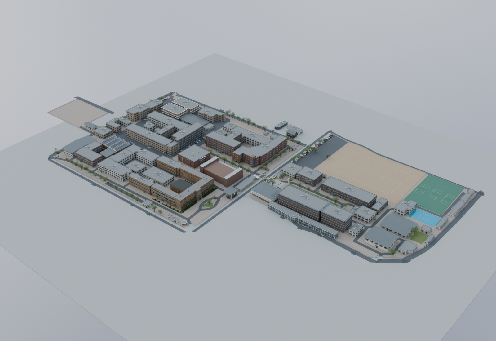
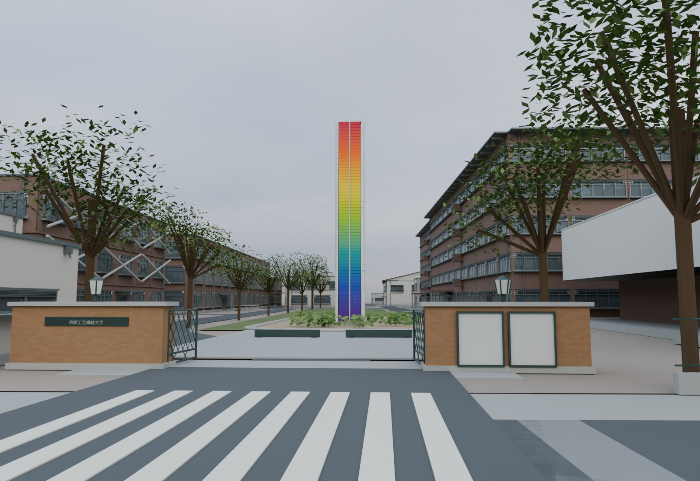
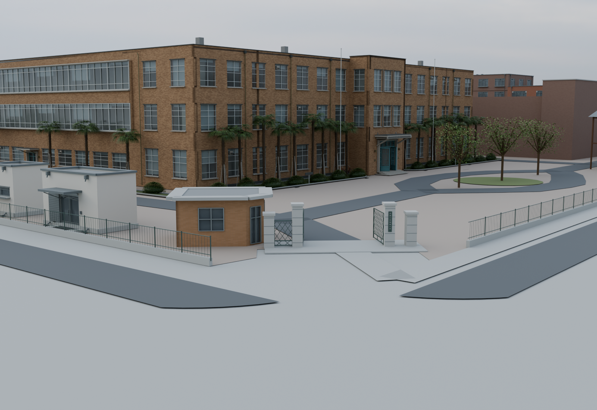

# KIT Matsugasaki 3D

京都工芸繊維大学・松ヶ崎キャンパス（東西両地区）の非公式3Dモデルです。Blenderで制作しています。

**Work in progress / 制作途中。** 建物の形状・寸法・入口には推定を含みます。測量モデルではありません。



## ダウンロード

[v0.1.0 制作途中版のダウンロード](https://github.com/aururn/kit-matsugasaki-3d/releases/tag/v0.1.0)

| ファイル | 内容 |
| --- | --- |
| `kit_matsugasaki_campus_v5.blend` | 東西キャンパス全体。建物、道路、植栽、校門、大学の塔 |
| `kit_building_studies_v5.blend` | 建物別75シーン・校門などの7シーンを切り替えて閲覧 |
| `SHA256SUMS.txt` | ダウンロードファイルの整合性確認用 |

`.blend` はReleasesのAssetsから取得してください。GitHubの「Code → Download ZIP」にはモデル本体は含まれません。ファイル内に必要なテクスチャ・フォントを格納しています。

## Blenderで見る

制作・検証環境は **Blender 5.2.0 LTS**。開くだけでスクリプトを実行する必要はありません。

- 中央ボタンドラッグ：回転、ホイール：拡大縮小、Shift＋中央ボタン：移動。
- テンキー0：カメラ表示。建物を選択してテンキーの小数点：選択対象へ移動。
- 建物別版は上部のシーン選択で建物を切り替えます。`Access |` は校門・塔などの視点です。
- 全体版のコレクション `09` に校門・塔・入口をまとめています。





## 収録範囲と精度

東西両地区、3号館の歴史建築、主要な校舎・施設、8か所の門、大学の塔、資料で位置を整理した48棟・65か所の入口を収録。75のカタログ項目には付属部分や分割部分が含まれ、大学の正式な建物数とは異なります。

建物輪郭はOpenStreetMap、建物名や入口は大学公開資料、外観は公開写真を照合しています。高さ、背面、屋上設備、細部寸法には推定が残ります。塔の高さ17 mは写真からの推定、位置は約5 mの不確かさを見込んでいます。全室の内装は作成していません。

[詳細な制作状況](docs/model-notes.md) / [出典](SOURCES.md) / [入口・門・塔の根拠データ](data/access-survey.json)

## 再生成

Blenderの実行ファイルをPATHへ追加し、リポジトリのルートで順に実行します。Windows PowerShellでも同じコマンドを使えます。Blender同梱のPython・NumPyを使用し、ビルド時に外部データを取得する必要はありません。

```sh
blender --background --factory-startup --disable-autoexec --python-exit-code 1 --python scripts/historic/build_historic.py -- --build-only
blender --background --factory-startup --disable-autoexec --python-exit-code 1 --python scripts/build_campus.py -- --build-only
blender --background --factory-startup --disable-autoexec --python-exit-code 1 --python scripts/create_building_studies.py
blender --background --factory-startup --disable-autoexec --python-exit-code 1 --python scripts/validate_v5.py
blender --background --factory-startup --disable-autoexec --python-exit-code 1 --python scripts/validate_studies.py
blender --background --factory-startup --disable-autoexec --python-exit-code 1 --python scripts/validate_public_assets.py
```

モデルは `build/`、検証結果は `reports/` に出力されます。検証はファイル整合性、配置、入口の開口を確認するもので、実測精度を保証しません。生成スクリプトは `data/` の生成済みカタログ・調査結果も更新します。

v0.1.0の配布モデルは制作版v5を `scripts/export_public.py` で梱包したものです。形状を保持し、日本語フォントと出典の埋め込みを公開用に整理しています。再生成手順もBlender 5.2.0で動作確認済みです。[公開時の検証結果](docs/validation/public-assets-validation.json)を収録しています。

静止画は `scripts/render_access.py`、入口配置図は `scripts/make_access_plan.py`（通常のPythonとPillowが必要）で作成できます。Cyclesレンダリングは対応GPUがあればOptiXを使用し、それ以外はCPUを使います。大きなモデルのため生成・レンダリングには時間とメモリを要します。

## ファイル構成

- `scripts/`：生成・描画・検証スクリプト。
- `data/`：建物輪郭、入口、配置、カメラ推定値。
- `assets/`：再配布可能な環境画像・路面画像・日本語フォント。
- `previews/`：モデルのレンダリングと配置図。
- `docs/`：調査記録・制作状況。
- `LICENSES/`：同梱素材と地理データのライセンス情報。

地理データ：© OpenStreetMap contributors、ODbL 1.0。独自部分の利用許諾は現時点で未設定です。[ライセンスの適用範囲](LICENSES/README.md)を参照してください。
